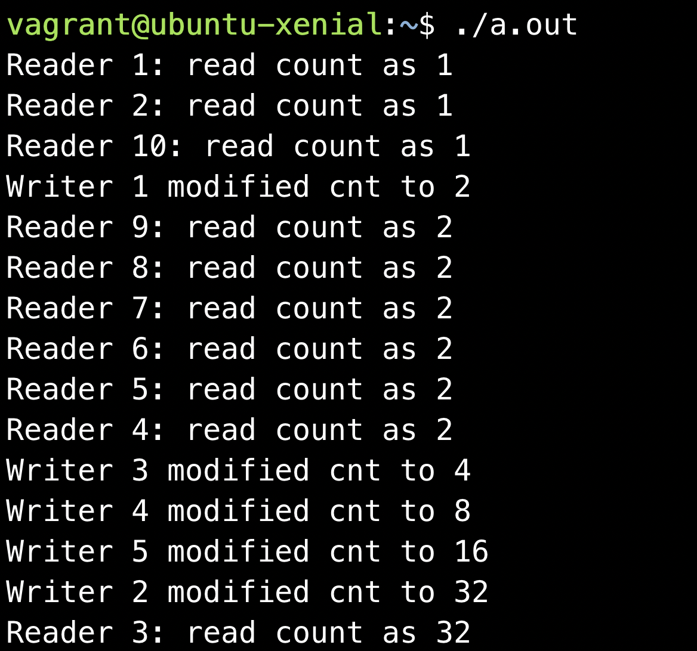

# Readers Writers Problem Solution Using Semaphore and Mutex
The first readers writers problem is one of the classical examples of synchronization. This program simulates a readers writers problem in C

**Blog** : https://shivammitra.com/reader-writer-problem-in-c

<b>Compiling the program:</b> gcc reader-writer.c -pthread

<b>Running the program:</b> ./a.out

**Output**

